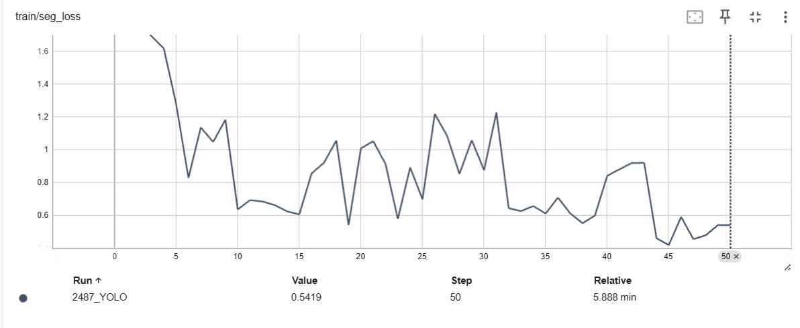
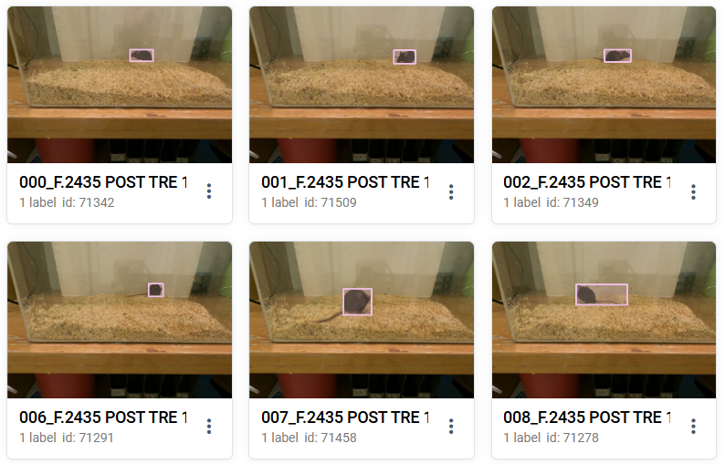

# Experiment "835 Mouse Detector"

## Buttons
- 🚀 Deploy (PyTorch)
- 🚀 Deploy (TensorRT)  -- Если был экспорт в TRT
- ⏩ Fine-tune
- 🔄 Re-train
- 📦 Download model
- ❌ Remove permamently

---

## Overview

- 🎓 [Training Task](https://dev.internal.supervisely.com/apps/146/sessions/1089)
- 📊 [Evaluation Report](https://dev.internal.supervisely.com/model-benchmark?id=262839)
- ⚡ [TensorBoard Logs](xxx)
- 💾 [Open in Team Files](https://dev.internal.supervisely.com/files/?path=%2Fexperiments%2F835_MP%3A%20Images%20Sample%20for%20Detection%20Task%20%28RTDETR2%20-%20cat%29%20Filtered%20and%20Splitted%2F1089_RT-DETRv2%2F)

---

- **Model**: RT-DETRv2-M
- **Task**: Object Detection
- **Framework**: [Train RT-DETRv2](https://dev.internal.supervisely.com/ecosystem/apps/rt-detr/supervisely_integration/train?id=225)
- **Project**: [MP: Images Sample for Detection Task (RTDETR2)](https://dev.internal.supervisely.com/projects/835/datasets) (6130 images)
- **Train dataset**: [train](Train) (5130 images)
- **Validation dataset**: [val](Val) (1000 images)
- **Classes**: 1
- **Class names**: mouse
- **Train time**: 1h 23m
- **Date**: 21 Feb 2025

| Checkpoints |
|---------|
| best.pt |
| last.pt |
| checkpoint005.pt |
| checkpoint010.pt |
| checkpoint015.pt |
| checkpoint020.pt |

## Training



## Predictions



## Metrics

| Metrics | Values |
|---------|--------|
| mAP | 0.9421 |
| AP50 | 0.9915 |
| AP75 | 0.9761 |
| f1 | 0.9210 |
| precision | 0.9051 |
| recall | 0.9341 |
| Avg. IoU | 0.9461 |
| Classification Acc. | 1.00 |
| Calibration Score | 0.9318 |
| Optimal confidence threshold | 0.6159 |

## Training Hyperparameters

```yaml
epoches: 100
batch_size: 16
eval_spatial_size: [640, 640]  # height, width

checkpoint_freq: 10
save_optimizer: false
save_ema: false

optimizer:
  type: AdamW
  lr: 0.0001
  betas: [0.9, 0.999]
  weight_decay: 0.0001

clip_max_norm: 1

lr_scheduler:
  type: MultiStepLR  # CosineAnnealingLR | OneCycleLR
  milestones: [80, 95]  # epochs
  gamma: 0.1

lr_warmup_scheduler:
  type: LinearWarmup
  warmup_duration: 300  # steps

use_ema: false
ema:
  type: ModelEMA
  decay: 0.9999
  warmups: 2000

use_amp: false
```

## Inference API

Deploy and predict in Supervisely.

```python
import supervisely as sly

api = sly.Api()

# Deploy
model = api.nn.deploy.custom(
    train_id={123},
    checkpoint="best.pt"
)

# Predict
prediction = model.predict(
    images="image.png"  # image | path | url
)
```

> See more in [Deploy and Predict with Supervisely SDK](https://docs.supervisely.com/neural-networks/overview-1/deploy_and_predict_with_supervisely_sdk) documentation.

## Docker

Predict using Docker container.

1. Download checkpoint from Supervisely ([download](xxx))

2. Pull the Docker image

```bash
docker pull {supervisely/rt-detrv2:1.0.11}
```
3. Run the Docker container

```bash
docker run \
  --runtime=nvidia \
  -v "./{1089_RT-DETRv2}:/model" \
  -p 8000:8000 \
  {supervisely/rt-detrv2:1.0.11} \
  predict \
  "./image.jpg" \
  --model "/model" \
  --device "cuda:0" \
```

> See more in [Deploy in Docker Container](https://docs.supervisely.com/neural-networks/overview-1/deploy_and_predict_with_supervisely_sdk#deploy-in-docker-container) documentation.

## Predict Locally

1. Download checkpoint from Supervisely ([download](xxx))

2. Clone repository

```bash
git clone https://github.com/supervisely-ecosystem/RT-DETRv2
cd RT-DETRv2
```

3. Install requirements

```bash
pip install -r dev_requirements.txt
pip install supervisely
```

4. Run inference

```python
# Be sure you are in the root of the RT-DETRv2 repository
from supervisely_integration.serve.rtdetrv2 import RTDETRv2

# Load model
model = RTDETRv2(
    checkpoint="./{1089_RT-DETRv2}/checkpoints/best.pt",  # path to the checkpoint
    device="cuda",
)

# Predict
prediction = model(image=777) <------ !!!!

prediction = model.predict(
    "image.png",  # local paths, directory, local project, np.array, PIL.Image, URL
    params={"confidence_threshold": 0.5}
)
```


Вопросы:
- Как загружать best.onnx / best.engine?

```python
# Be sure you are in the root of the RT-DETRv2 repository
from supervisely_integration.serve.rtdetrv2 import RTDETRv2

model = RTDETRv2(
    model_dir="./{1089_RT-DETRv2}",
    checkpoint="best.onnx",  # or "best.engine"
    device="cuda",
)
```

## Standalone Model

## Predict standalone (whithout Supervisely dependencies)

https://github.com/lyuwenyu/RT-DETR/blob/main/rtdetrv2_pytorch/references/deploy/rtdetrv2_torch.py
